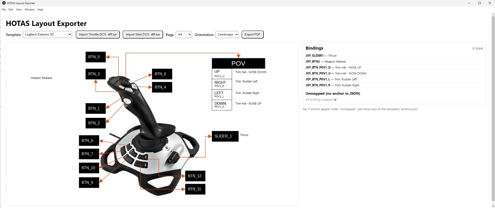

# dcs-hotas-layout
An app that takes your DCS joystic and throttle settings, and creates a picture and button layout of your stick and throttle.

If you ever wanted to easily create a button mapping picture for your joystick and thrust controller for reference
this is the tool for you.

Or if you want a picture of the mapping of someone elses configuration. For example:
CAP'S X-56 HOTAS MAPS: 
https://drive.google.com/drive/folders/1g7op9YxNbWi8fogam0tK0yer1rRCLe7A

A small app that takes your (or someone elses) Digital Combat Flight Simulator (DCS) settings files
and displays the settings on your flightstick. You can create a PDF for later reference.

It is built with a template system so it can support multiple sticks.
Right now i have only added the Logitech X-56 and Logitech Extreme 3D, But it is quite straight forward
to add another stick as well. I just added those 2 because those are the ones i have myself.

For many systems there are 2 files. One for the stick and one for the throttle, because they are two diffrent units.

Your config files for your stick reside in:
C:\Users\<your username>\Saved Games\ DCS\Config\Input\<aircraft>\joystick\

